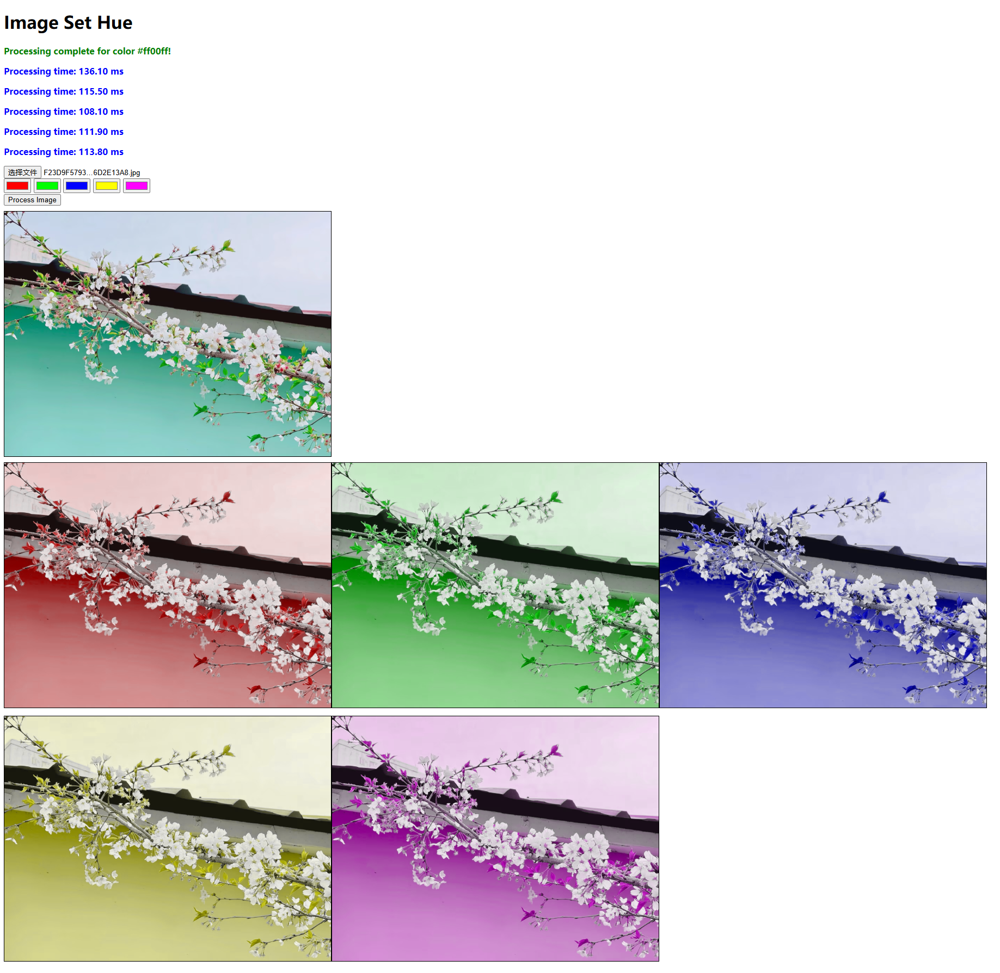
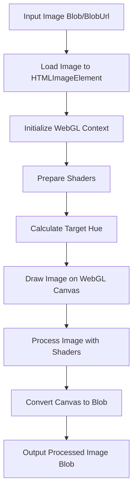

# Image Set Hue

This project is a Vite-based library written in TypeScript. It provides a curried function to process images by converting their RGB colors to HUE and adjusting all hues to match a given target hue.



[中文文档](README.zh.md)

## Features

- **Input Flexibility**: Accepts an image as a Blob or BlobUrl.
- **Color Conversion**: Converts RGB colors to HUE.
- **Hue Adjustment**: Adjusts all hues to a specified target hue.
- **Output**: Returns the processed image as a Blob.

## How It Works

1. **Image Loading**:
   - The input image (Blob or BlobUrl) is loaded into an HTMLImageElement.
   - A WebGL context is initialized to process the image.

2. **Shader Preparation**:
   - Vertex and fragment shaders are created to handle the image processing.
   - The fragment shader converts RGB colors to HSL, adjusts the hue, and converts back to RGB.

3. **Hue Calculation**:
   - The target hue is calculated from the provided target color using the `d3-color` library.

4. **Image Processing**:
   - The image is drawn onto a WebGL canvas.
   - The shaders process the image to adjust its hues.

5. **Output Generation**:
   - The processed image is converted back to a Blob using the canvas API.

## Installation

You can install the package from npm:

```bash
npm install image-set-hue
```

Or if you are using yarn:

```bash
yarn add image-set-hue
```

## Development

If you want to contribute or modify the library, you can clone the repository and:

```bash
# Install dependencies
npm install

# Start the development server
npm run dev
```

## Build

To build the library locally:

```bash
npm run build
```

## Usage

Import the library and use the provided function to process images:

```typescript
import { processImage } from 'image-set-hue';

// Example 1: Process an image with a specific color
const imageBlob = await fetch('/path/to/image.jpg').then(res => res.blob());
const processWithHue = processImage(imageBlob);
const resultBlob = await processWithHue('#9370DB'); // Using a purple color

// Example 2: Using with file input
document.getElementById('fileInput').addEventListener('change', async (e) => {
  const file = e.target.files[0];
  const processWithHue = processImage(file);
  const result = await processWithHue('#FF5733'); // Using an orange color
  
  // Display the processed image
  const imgElement = document.getElementById('outputImage');
  imgElement.src = URL.createObjectURL(result);
});

// Example 3: Process with URL
const processWithUrl = processImage('https://example.com/image.jpg');
const processed = await processWithUrl('rgb(100, 150, 200)'); // Using RGB format
```

## Workflow Diagram

Below is a simplified flowchart of the image processing workflow:



## Technical Details

### Curried Function Design

The library uses a curried function design pattern, which divides image loading and processing into two stages:

1. The first stage receives the input image and creates the processing context.
2. The second stage receives the target hue and performs the actual processing.

This design allows you to load an image once and then process it multiple times with different hues without reloading the image.

### WebGL Shaders

Image processing is implemented using WebGL shaders to achieve efficient parallel computation:

- **Vertex Shader**: Defines image coordinates and texture mapping.
- **Fragment Shader**: Implements RGB to HSL conversion, hue adjustment, and HSL to RGB conversion.

### Performance Optimizations

To enhance performance, the library implements the following optimizations:

1. **Image Caching**: Once loaded, images are cached to avoid repeated loading.
2. **WebGL Hardware Acceleration**: Utilizes GPU for parallel color calculations.
3. **Single-Pass Processing**: All color conversions and adjustments are done in a single shader pass.

## Browser Compatibility

The library is compatible with all modern browsers that support WebGL, including:

- Chrome 9+
- Firefox 4+
- Safari 5.1+
- Edge 12+
- Opera 12+
