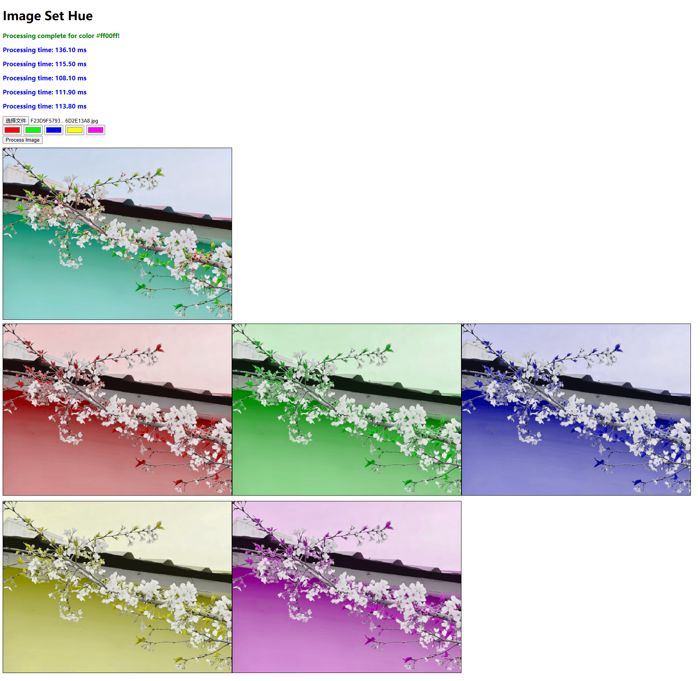

# Image Set Hue

这是一个基于 Vite 的 TypeScript 库项目。它提供了一个柯里化函数，用于处理图像，将图像的 RGB 颜色转换为 HUE，并将所有色相调整为匹配给定的目标色相。



[English Documentation](README.md)

## 安装

您可以通过npm安装该包：

```bash
npm install image-set-hue
```

或者如果您使用yarn：

```bash
yarn add image-set-hue
```

## 使用方法

导入库并使用提供的函数处理图像：

```typescript
import { processImage } from 'image-set-hue';

// 示例1：使用特定颜色处理图像
const imageBlob = await fetch('/path/to/image.jpg').then(res => res.blob());
const processWithHue = processImage(imageBlob);
const resultBlob = await processWithHue('#9370DB'); // 使用紫色

// 示例2：与文件输入一起使用
document.getElementById('fileInput').addEventListener('change', async (e) => {
  const file = e.target.files[0];
  const processWithHue = processImage(file);
  const result = await processWithHue('#FF5733'); // 使用橙色
  
  // 显示处理后的图像
  const imgElement = document.getElementById('outputImage');
  imgElement.src = URL.createObjectURL(result);
});

// 示例3：使用URL进行处理
const processWithUrl = processImage('https://example.com/image.jpg');
const processed = await processWithUrl('rgb(100, 150, 200)'); // 使用RGB格式
```

## 功能特点

- **输入灵活性**：接受 Blob 或 BlobUrl 格式的图像。
- **颜色转换**：将 RGB 颜色转换为 HUE。
- **色相调整**：将所有色相调整为指定的目标色相。
- **输出**：以 Blob 格式返回处理后的图像。

## 工作原理

1. **图像加载**：
   - 输入图像（Blob 或 BlobUrl）被加载到 HTMLImageElement 中。
   - 初始化 WebGL 上下文以处理图像。

2. **着色器准备**：
   - 创建顶点和片段着色器以处理图像。
   - 片段着色器将 RGB 颜色转换为 HSL，调整色相，然后转换回 RGB。

3. **色相计算**：
   - 使用 `d3-color` 库从提供的目标颜色计算目标色相。

4. **图像处理**：
   - 图像绘制到 WebGL 画布上。
   - 着色器处理图像以调整其色相。

5. **输出生成**：
   - 使用画布 API 将处理后的图像转换回 Blob。

## 开发

如果您想贡献或修改该库，您可以克隆存储库并执行：

```bash
# 安装依赖
npm install

# 启动开发服务器
npm run dev
```

## 构建

要在本地构建该库：

```bash
npm run build
```

## 工作流程图

以下是图像处理工作流程的简化流程图：


## 技术细节

### 柯里化函数设计

该库使用柯里化函数设计模式，使图像加载和处理分为两个阶段：

1. 第一阶段接收输入图像并创建处理上下文。
2. 第二阶段接收目标色相并执行实际处理。

这种设计允许您加载图像一次，然后使用不同的色相多次处理它，而无需重新加载图像。

### WebGL 着色器

图像处理使用 WebGL 着色器实现，以实现高效的并行计算：

- **顶点着色器**：定义图像坐标和纹理映射。
- **片段着色器**：实现 RGB 到 HSL 的转换，色相调整和 HSL 到 RGB 的转换。

### 性能优化

为了提高性能，该库实现了以下优化：

1. **图像缓存**：一旦加载，图像将被缓存以避免重复加载。
2. **WebGL 硬件加速**：利用 GPU 进行并行颜色计算。
3. **单次通道处理**：所有颜色转换和调整都在单个着色器通道中完成。

## 浏览器兼容性

该库兼容所有支持 WebGL 的现代浏览器，包括：

- Chrome 9+
- Firefox 4+
- Safari 5.1+
- Edge 12+
- Opera 12+
